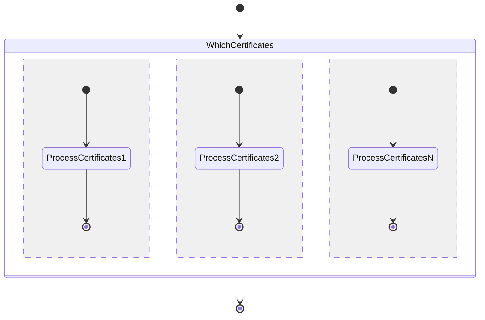

# Letsencrypt Cert Manager
Letsencrypt is a great solution for creating and managing your own certificates,
but the short lifespan of certificates leads towards a need for automating their
lifecycle. The certbot tool is great for automating these tasks, but it often is
setup to run on a standalone instance, restricting your certificate storage to
a single point of failure. After reading a blog post from Arkadiy Tetelman on
[Deploying EFF's Certbot in AWS Lambda](https://arkadiyt.com/2018/01/26/deploying-effs-certbot-in-aws-lambda/),
I found myself inspired to expand upon it to make a tool for managing multiple
certificates within an organization.

The Letsencrypt Cert Manager creates and updates certificates from Letsencrypt
using AWS resources. Certificates are stored in ACM for use within AWS as needed,
and are also stored in S3 so they can be used within systems external to AWS.
DynamoDB, Lambdas, and a Step Function is used to control which domains we need
to manage certificates for, and to check and see if any certificates need to be
created or updated.

## Usage

### Prerequisites

Before deploying this tool, an S3 bucket must be created. This bucket will be used
to upload our Lambdas into for their deployment via CloudFormation, and will also
be used by the Cert Manager to store certificates in. (**Note:** You'd likely want to
keep tighter control over your certificates in a production environment.)

Additionally, [AWS SAM CLI](https://github.com/awslabs/aws-sam-cli) must be installed
as we use it to package up and deliver the Lambda to the S3 bucket referenced above.

### Deployment

Create an S3 Bucket that you have rights to write to and note its name. For
the purpose of this README, we'll be assuming a bucket name of
`letsencrypt-cert-manager-bucket-012345`.

Package and upload the Certbot Runner Lambda via AWS SAM CLI:
```
sam build --template certbot-runner/template.yaml --use-container && sam package --s3-bucket letsencrypt-cert-manager-bucket-012345
```

Package and upload the Certbot Validator Lambda via AWS SAM CLI:
```
sam build --template certbot-validator/template.yaml --use-container && sam package --s3-bucket letsencrypt-cert-manager-bucket-012345
```

The above `sam package` commands will return a CodeUri of where the package was
uploaded to. Deploy the CFN stack, passing in parameters for the bucket created
above, along with keys for both uploaded Lambdas (these will be a unique ID such
as `869c184ef508ab4a94a70f5795bfb5c2`).
```
aws cloudformation create-stack --stack-name letsencrypt-cert-manager \
--template-body file://cloudformation.template \
--capabilities CAPABILITY_NAMED_IAM CAPABILITY_AUTO_EXPAND \
--parameters ParameterKey=CertManagerBucket,ParameterValue=letsencrypt-cert-manager-bucket-012345 \
ParameterKey=CertbotRunnerKey,ParameterValue=5a985c2e1365709a1d8493a36cb1c0f6 \
ParameterKey=CertbotVentilatorKey,ParameterValue=869c184ef508ab4a94a70f5795bfb5c2
```

Add a new domain (or domains) to a new row within the `subject_alternative_name`
column of the DynamoDB table provisioned by CloudFormation. New certificates will
be available after the daily StepFunction execution, or invoke the StepFunction
manually to immediately process certificates.

### Running AWS SAM Local

AWS SAM Local is a great way to test serverless applicationals locally in a docker container. [Check it out](https://github.com/awslabs/aws-sam-cli).

Once AWS SAM Local is installed, prepare your SAM container by running the command below from within the `certbot-ventilator` or `certbot-runner` directories.
(**Note:** Any additional external libraries must be added to _requirements.txt_ to be successfully packaged by the below command.)
```bash
sam build --use-container
```

After this has been done, you can initialize a SAM Local run with the following code from within the `certbot-ventilator` or `certbot-runner` directories:
```bash
sam local invoke "CertbotVentilator" -e tests/payloads/success.json
sam local invoke "CertbotRunner" -e tests/payloads/success.json
```

### Installing dependencies

```bash
make install-dev
```

### Running tests

To run our unit tests you can run:

```bash
make test
```

This will generate a coverage report in `coverage_html/index.html`

### Running lint

To lint the code run:

```bash
make lint
```

If you don't get any output that means your linting passed.

## Resources

The Letsencrypt Cert Manager creates a variety of resources in AWS to help
manage your certificates. It also stores created certificates within both AWS
ACM and S3, so you can use them with both AWS and external resources. 

### DynamoDB

A DynamoDB table is created to store which domains the Letsencrypt Cert Manager
should be in charge of. The `subject_alternative_name` column of this table
is referenced by the `certbot-ventilator` to determine how many certificates to
fan out and create.

### Step Function

The `WhichCertificates` state invokes the certbot-ventilator Lambda which scans
the `subject_alternative_name` column in the DynamoDB table provisioned by this
repository to create a list of domains to manage. Values in this column can be
a single domain name, or multiple domains separated by commas (in the case of a
single certificate for multiple domains). The output of this Lambda is then
passed into a _Map_ task in the StepFunction to dynamically invoke a `ProcessCertificates`
state for each of the invidual domains/SANs that exist in the DynamoDB column.
Each `ProcessCertificates` state invokes an individual [certbot-runner](https://github.com/cgartner/letsencrypt-cert-manager/certbot-runner) Lambda,
which takes care of creating/updating a certificate if needed.

#### Diagram



### Certbot Ventilator Lambda

This Lambda is invoked by the StepFunction defined in this repository. It creates
a list of certificates to manage, which is then used by the StepFunction to fan-out
to multiple downstream Lambdas, each of which manage a single certificate's lifecyle.

If a certificate doesn't exist in ACM, a new one is provisioned. If an existing
certificate is found but expires in less than 30 days, a new one is provisioned
as well. Newly provisioned certificates are placed in both ACM and S3 for use by
services both internal and external to AWS. An Event Rule has been created that
invokes this StepFunction daily to ensure that stored certificates always have at
least 30 days of validity left.

#### Event

The ventilator requires three keys in the event. Each of these keys get passed
into the downstream [certbot-runner](https://github.com/cgartner/letsencrypt-cert-manager/certbot-runner)
Lambda that is invoked by the StepFunction created by this repository. Each of
these keys is defined in the `cloudformation.template` file at the root of this
repository, but these keys can also be defined for running the Lambda locally.

```json
{
    "certbot_server": "https://acme-staging-v02.api.letsencrypt.org/directory",
    "email": "certbot@my.org",
    "s3_bucket": "letsencrypt-cert-manager-bucket-012345"
}
```

| name            | type   | description                                      |
| ----            | ------ | ---------------------------------------------    |
| certbot_server  | String | URL of the LetsEncrypt server for certbot to use |
| email           | String | Email address to assign to certificates          |
| s3_bucket       | String | The S3 bucket to store certificates/keys in      |

#### Output

```json
{
  "output": {
    "certbot_server": "https://acme-staging-v02.api.letsencrypt.org/directory",
    "domains": [
      "subdomain1.my.org",
      "subdomain2.my.org",
      "subdomain3.my.org"
    ],
    "email": "certbot@my.org",
    "s3_bucket": "letsencrypt-cert-manager-bucket-012345"
  }
}
```

### Certbot Runner Lambda

This Lambda is invoked by the StepFunction defined in the root of this repository.
An event is passed in which contains keys used for the management a single
certificate's lifecyle.

If a certificate doesn't exist in ACM, a new one is provisioned. If an existing
certificate is found but expires in less than 30 days, a new one is provisioned
as well. Newly provisioned certificates are placed in both ACM and S3 for use by
internal and external services.

While this Lambda is typically called from the StepFunction, you can also invoke
this Lambda with a standalone event to provision a single certificate.

#### Event

**Note:** The `domains` key can be one or many domains, as this value gets passed
into _Subject Alternative Name (SAN)_ of the certificate. If multiple domains are
supplied, the _first_ domain name is used as the name of the certificate in ACM
and S3.

```json
{
    "certbot_server": "https://acme-staging-v02.api.letsencrypt.org/directory",
    "domains": "subdomain.my.org",
    "email": "certbot@my.org",
    "s3_bucket": "letsencrypt-cert-manager-bucket-012345"
}
```

| name            | type   | description                                                        |
| ----            | ------ | ---------------------------------------------                      |
| certbot_server  | String | URL of the LetsEncrypt server for certbot to use                   |
| domains         | String | One or more domains to generate a certificate for, comma-separated |
| email           | String | Email address to assign to certificates                            |
| s3_bucket       | String | The S3 bucket to store certificates/keys in                        |

#### Output

If a new certificate was provisioned:
```json
{
  "output": {
    "message": "A new certificate has been provisioned and uploaded to both S3 and ACM for: subdomain.my.org",
    "status": "success"
  }
}
```

If a certificate with more than 30 days left exists:
```json
{
  "output": {
    "message": "A certificate with at least 30 days until expiration already exists in both S3 and ACM for: subdomain.my.org",
    "status": "success"
  }
}
```

## Dependencies

- LetsEncrypt/Certbot

### AWS

- StepFunctions
- Lambda
- Route53
- ACM
- S3

## Additional Resources

- [Deploying EFF's Certbot in AWS Lambda](https://arkadiyt.com/2018/01/26/deploying-effs-certbot-in-aws-lambda/) - Inspiration for this system came from this post
- [Dynamic Parallelism](https://medium.com/swlh/step-functions-dynamic-parallelism-fan-out-explained-83f911d5990) - StepFunction Dynamic Parallelism explained.
- [Sample Map State](https://docs.aws.amazon.com/step-functions/latest/dg/sample-map-state.html) - Map State Examples

## Authors

- **Chad Gartner** - _Initial work_
